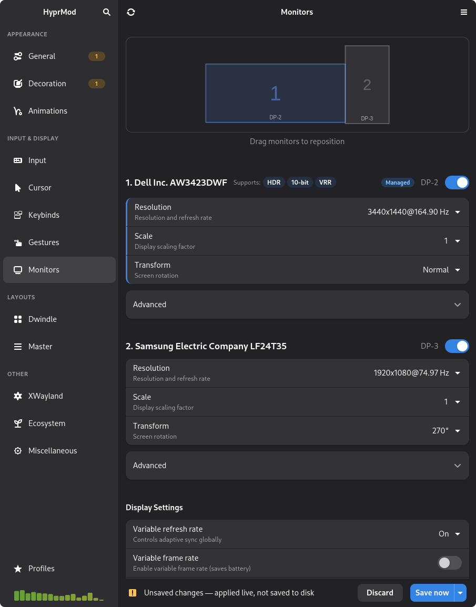
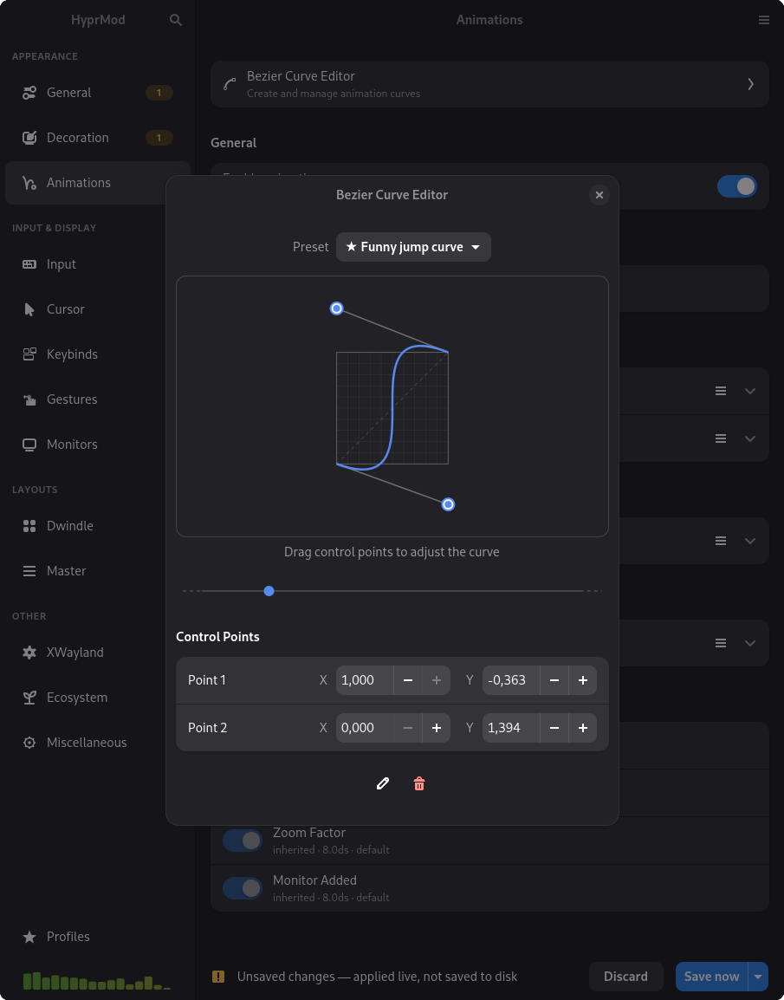

# HyprMod

A native GTK4/libadwaita settings app for [Hyprland](https://hyprland.org) — tweak any option, see it change live, save when you're happy.

<p>
  
  
</p>

## 📺 Video

<a href="https://youtu.be/PF3qgfR0XP0" target="_blank">
  
</a>

## ⚡ Highlights

- **Live preview** — every change applies instantly to your running compositor. No need to restart or reload.
- **Your config stays untouched** — HyprMod writes only to its own `hyprland-gui.conf`. Your hand-crafted config is never modified.
- **Undo with Ctrl+Z** — changes apply live, so mistakes need a quick escape hatch. Step back one change at a time.
- **Profiles** — save, name, and switch between complete configurations. Each profile is a shareable `.conf` file.

## ✨ Features

- **Bezier Curve Editor** — draggable control points, live animation preview, preset library, bidirectional sync between canvas and number inputs
- **Monitor Configuration** — per-monitor resolution, refresh rate, position, scale, transform, and mirroring controls with a layout preview canvas. VRR, HDR, and 10-bit detection.
- **Keybind Editor** — modifier toggles, interactive key capture, dispatcher selection. Your original binds shown read-only for reference.
- **Cursor Theme Picker** — browse installed cursor themes with live previews and apply with one click.
- **Config DNA** — every profile gets a unique visual fingerprint derived from a hash of your settings. A visual signature for your rice.
- **Global Search** — Ctrl+F across all options, navigates to the match with a highlight pulse
- **Micro-interactions** — accent borders on modified options, inline reset buttons, animated save states, shake on error

## 📦 Installation

> HyprMod is in active development and not yet packaged for distribution.

Requires Python 3.12+, GTK4, libadwaita, and a running Hyprland instance.

```bash
git clone https://github.com/BlueManCZ/hyprmod.git
cd hyprmod
uv sync
uv run hyprmod
```

Or with [pipx](https://pipx.pypa.io):

```bash
git clone https://github.com/BlueManCZ/hyprmod.git
cd hyprmod
pipx install .
hyprmod
```

On first launch, HyprMod asks permission to add one `source` line to your `hyprland.conf` — that's the only time it touches your config.

## 🔧 How It Works

```
Running Hyprland
      |  ^
      |  |  getoption via Unix socket  (read on startup)
      |  |  keyword via Unix socket    (write on every widget change)
      v  |
  HyprMod (GTK4 app)
           |
           |  on Save
           v
  ~/.config/hypr/hyprland-gui.conf    <-- owned entirely by this app
```
